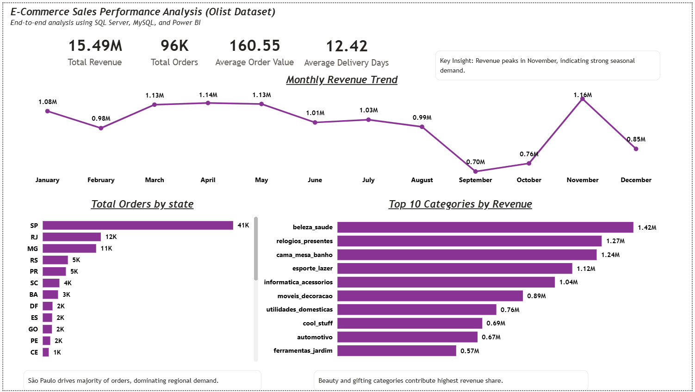
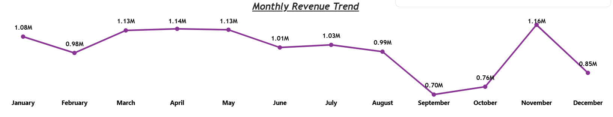
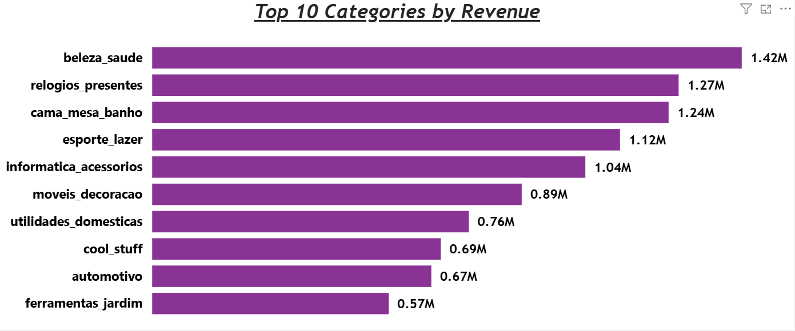

 # Sales Analytics Pipeline  
**SQL Server → MySQL → Power BI**

## Overview

This project is an end-to-end analysis of an e-commerce business using the Olist dataset.  
The focus was not just on visuals, but on building a clean data pipeline, validating numbers across systems, and extracting insights that actually matter for business decisions.

The same logic was implemented and validated across **SQL Server**, **MySQL**, and **Power BI** to ensure consistency between test and production-style environments.

---

## Architecture

Raw CSV Data → SQL Server (Test) → SQL Server (Production) → MySQL → Power BI

All transformations were handled using SQL.  
Power BI connects only to the final fact table.

---

## Tools Used

- **SQL Server** – Initial data modeling and validation
- **MySQL** – Production-style migration and fact table creation
- **Power BI** – KPI tracking and interactive dashboard
- **GitHub** – Version control and project documentation

---

## Data Modeling

- Raw CSV files were loaded without modification
- Data cleaning and calculations were handled using SQL views
- A consolidated fact table (`fact_sales_report`) was created for reporting
- Power BI uses a single-table model for simplicity and performance

---

## Challenges & Solutions

### CSV Ingestion in MySQL
- Faced strict `secure_file_priv` and data truncation issues
- Empty strings caused integer conversion errors  
  → Used `LOAD DATA INFILE` with proper escaping and `NULLIF` handling

### Datetime Compatibility
- SQL Server auto-parses datetime values
- MySQL requires explicit formats  
  → Applied `STR_TO_DATE()` and filtered invalid records inside views

### Metric Validation
- Row counts and revenue totals were validated across:
  - SQL Server
  - MySQL
  - Power BI  
Ensured exact parity before switching Power BI source

---

## PBI Dashboard Overview

## Core Business Metrics
- **Total Revenue:** 15.49M  
- **Total Orders:** 96K  
- **Average Order Value:** 160.55  
- **Average Delivery Time:** 12.42 days  

All metrics were cross-verified between SQL queries and Power BI measures to avoid reporting mismatches.

----

## Key Insights from Dashboard

### Revenue Trend & Seasonality

- Revenue peaks in **November (1.16M)**, indicating strong seasonal demand.
- **September records the lowest revenue (0.70M)** before a sharp recovery in Q4.
- Clear evidence that sales are heavily influenced by seasonal buying behavior.

### Category Performance

- **Top 10 product categories contribute ~62.4% of total revenue**.
- Highest contributing categories:
  - *beleza_saude* – 1.42M  
  - *relogios_presentes* – 1.27M  
  - *cama_mesa_banho* – 1.24M  
- Revenue is highly concentrated, making category prioritization critical.

### Regional Demand
- **São Paulo (SP) alone accounts for ~41K orders**, far ahead of other states.
- RJ and MG follow but with significantly lower volumes.
- Regional demand is clearly skewed, suggesting operational focus should start with SP.

## Revenue, Orders & Delivery Impact

### Observations
- High-order categories do not always generate high revenue.
- Premium categories earn more revenue with fewer orders.
- Longer delivery times are associated with lower customer review scores.

### Business Takeaways
- Re-evaluate pricing for high-volume, low-revenue categories.
- Improve logistics to increase customer satisfaction.
- Increase inventory and marketing spend before November peak.

---

## Repository Structure

sales-analytics-pipeline/
├── sql-server/
├── mysql/
├── powerbi/
├── screenshots/
└── README.md

---

## Outcome

- Successfully migrated analytics backend from SQL Server to MySQL
- Power BI dashboards required no redesign
- Metrics matched across all systems
- SQL scripts are reusable and production-oriented

